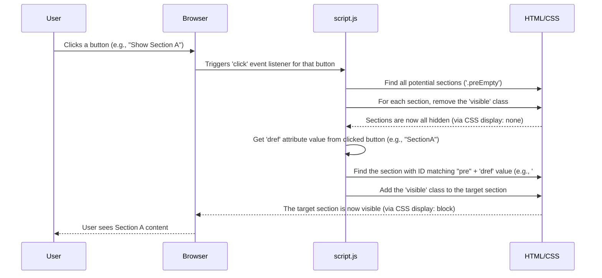

# Chapter 1: Dynamic Section Switching

Welcome to the first chapter of the `portfolio-repo` tutorial! We're starting our journey by exploring a fundamental concept in web development: making parts of your page change dynamically without needing to load a brand new page. Think of this as creating interactive elements right on the page you're already viewing.

## What is Dynamic Section Switching?

Imagine you're on a website that shows different information about a product. Instead of clicking a link and waiting for a whole new page to load for the product's specifications, then clicking another link and waiting for another page for customer reviews, wouldn't it be nicer if the specifications and reviews just appeared and disappeared on the *same* page as you clicked different "tabs"?

That's what dynamic section switching is all about! It's a technique used to:

1.  **Hide** certain parts (or "sections") of your web page.
2.  **Show** other parts of your web page.
3.  Do this instantly, usually when a user clicks something like a button or a link.

It's like having a binder with many documents inside. Instead of taking out one document and putting in another (which is like loading a new page), you just flip the tab to see a different document already inside the binder. All the documents are *there*, but only one is fully visible at a time.

In our portfolio project, we use this concept to show different types of content, like specific project details or explanations, right within the same area of the page. This makes the site feel faster and more interactive.

## How Does it Work? The Basic Idea

To make this happen, we need three main ingredients working together:

1.  **HTML:** This gives us the structure. We need separate containers (like `<div>` or `<section>`) for each piece of content we might want to show or hide. We also need something clickable (like `<button>`) to trigger the switch.
2.  **CSS:** This controls how things look. We use CSS to define rules that can either make an element visible or completely hide it from view.
3.  **JavaScript:** This adds the interactivity. JavaScript listens for clicks on our buttons. When a click happens, JavaScript changes the CSS rules on the content sections to hide the currently visible one and show the one we want to see.

Let's look at a simplified example of the HTML structure you might see:

```html
<button dref="SectionA">Show Section A</button>
<button dref="SectionB">Show Section B</button>

<div id="preSectionA" class="content-section">
  <!-- Content for Section A goes here -->
  This is the information for Section A.
</div>

<div id="preSectionB" class="content-section">
  <!-- Content for Section B goes here -->
  This is the information for Section B.
</div>
```

Notice a couple of things here:

*   We have two `<button>` elements. Each button has a special attribute called `dref`. This attribute holds a value (`SectionA` or `SectionB`) that tells us *which* section this button should control.
*   We have two `<div>` elements, each with an `id` that matches the `dref` value from a button, but prefixed with `"pre"`. For example, the button with `dref="SectionA"` corresponds to the `div` with `id="preSectionA"`. This is how our code knows which section belongs to which button.
*   Both `div`s have a class `content-section`. This class might contain CSS rules to style the sections and, importantly, initially hide them.

Now, how do we hide and show these sections using CSS? We can define CSS rules like this:

```css
/* Stylesheet (e.g., style.css) */

.content-section {
  display: none; /* By default, hide all content sections */
}

.content-section.visible {
  display: block; /* When a section has the 'visible' class, show it */
}
```

Here, the `.content-section` rule uses `display: none;` to make elements invisible and not take up any space on the page. The `.content-section.visible` rule targets elements that have *both* the `content-section` class *and* the `visible` class. It overrides the `display: none;` with `display: block;` (or `flex`, `grid`, etc., depending on layout needs) to make the section appear.

Our JavaScript's job will be to listen for button clicks and toggle this `visible` class on the correct section `div`s.

## Making it Dynamic with JavaScript

Let's look at the part of the `script.js` file that handles this dynamic switching. This code runs after the entire page (the HTML structure) has been loaded.

```javascript
// --- File: script.js ---
document.addEventListener("DOMContentLoaded", function () {
  // ... (other code)

  const buttons = document.querySelectorAll("[dref]"); // Select all buttons with dref attribute
  const preElements = document.querySelectorAll(".preEmpty"); // Select all <pre> elements (these are our sections)

  buttons.forEach((button) => {
    button.addEventListener("click", function () {
      // Remove 'visible' class from all <pre> elements
      preElements.forEach((pre) => {
        pre.classList.remove("visible");
      });

      // Get the target <pre> element and add 'visible' class
      const targetPre = document.getElementById(
        "pre" + button.getAttribute("dref")
      );
      if (targetPre) {
        targetPre.classList.add("visible");
      }
    });
  });

  // ... (other code)
});
```

Let's break down what this code does step by step:

1.  `document.addEventListener("DOMContentLoaded", function () { ... });`
    *   This is a standard way to ensure our JavaScript code runs only *after* the entire HTML page has been loaded and understood by the browser. This is important because our code needs to find HTML elements (like buttons and sections) to work.

2.  `const buttons = document.querySelectorAll("[dref]");`
    *   This line finds all HTML elements that have the `dref` attribute. In our example HTML above, this would select both `<button dref="SectionA">` and `<button dref="SectionB">`. It stores them in a list called `buttons`.

3.  `const preElements = document.querySelectorAll(".preEmpty");`
    *   This line finds all HTML elements with the class `preEmpty`. In our project's specific code, the content sections being switched are `<pre>` tags with the class `preEmpty`, rather than `<div>` with `content-section`. This line selects all of those potential content sections and stores them in a list called `preElements`.

4.  `buttons.forEach((button) => { ... });`
    *   This starts a loop. It goes through each `button` that we found in step 2. For *each* button, it sets up something that should happen when that button is clicked.

5.  `button.addEventListener("click", function () { ... });`
    *   Inside the loop, for the current `button`, this line adds a "listener". It's like telling the button, "Hey, if you ever get clicked, run the code inside this function!".

6.  `preElements.forEach((pre) => { pre.classList.remove("visible"); });`
    *   This is the *first* thing that happens when any button is clicked. It loops through *all* the potential content sections (`preElements`) and removes the `visible` class from them. This is crucial! It makes sure that whatever section was previously visible now gets hidden, so we don't have multiple sections showing at once.

7.  `const targetPre = document.getElementById("pre" + button.getAttribute("dref"));`
    *   Still inside the click function, this line figures out *which* section should be shown.
    *   `button.getAttribute("dref")` gets the value from the clicked button's `dref` attribute (e.g., "SectionA").
    *   `"pre" + ...` adds the "pre" prefix to that value (e.g., "preSectionA").
    *   `document.getElementById(...)` finds the single HTML element on the page that has that specific ID (e.g., finds the `<pre id="preSectionA">`). This is our target section!

8.  `if (targetPre) { targetPre.classList.add("visible"); }`
    *   This checks if a target section was actually found (it should be, if our `dref` attributes match the section IDs).
    *   If found, `targetPre.classList.add("visible");` adds the `visible` class to our target section. Based on the CSS we saw earlier, adding this class makes the section appear!

So, in summary, when you click a button: all potential sections are hidden, and then only the single section linked to that button by its `dref` attribute and corresponding ID is made visible.

## Under the Hood: The Process

Let's visualize the flow when a user clicks a button designed for section switching.



This diagram shows the steps: the user action triggers JavaScript, which manipulates CSS classes on HTML elements to control their visibility, resulting in the user seeing the desired content instantly without a page reload.

## Conclusion

In this chapter, we learned about **Dynamic Section Switching**, a powerful technique to create interactive web pages where content appears and disappears instantly based on user actions, like clicking buttons. We saw how HTML provides the structure and linking (`dref` attribute and `id`), CSS handles the hiding and showing (`display: none;` and the `.visible` class), and JavaScript provides the logic to listen for clicks and manage the CSS classes accordingly.

This concept of showing/hiding elements based on user input is fundamental and will be used in various parts of the project.

Ready to see another way this dynamic interaction is used? In the next chapter, we'll look at how this principle, along with other techniques, is applied to create the user interface for the chatbot feature: [Chatbot UI & Interaction](02_chatbot_ui___interaction_.md).

---

<sub><sup>Generated by [AI Codebase Knowledge Builder](https://github.com/The-Pocket/Tutorial-Codebase-Knowledge).</sup></sub> <sub><sup>**References**: [[1]](https://github.com/jasper890/portfolio-repo/blob/792af8364fb0f758e482ba1a7b7a882cfb0a3832/script.js)</sup></sub>
