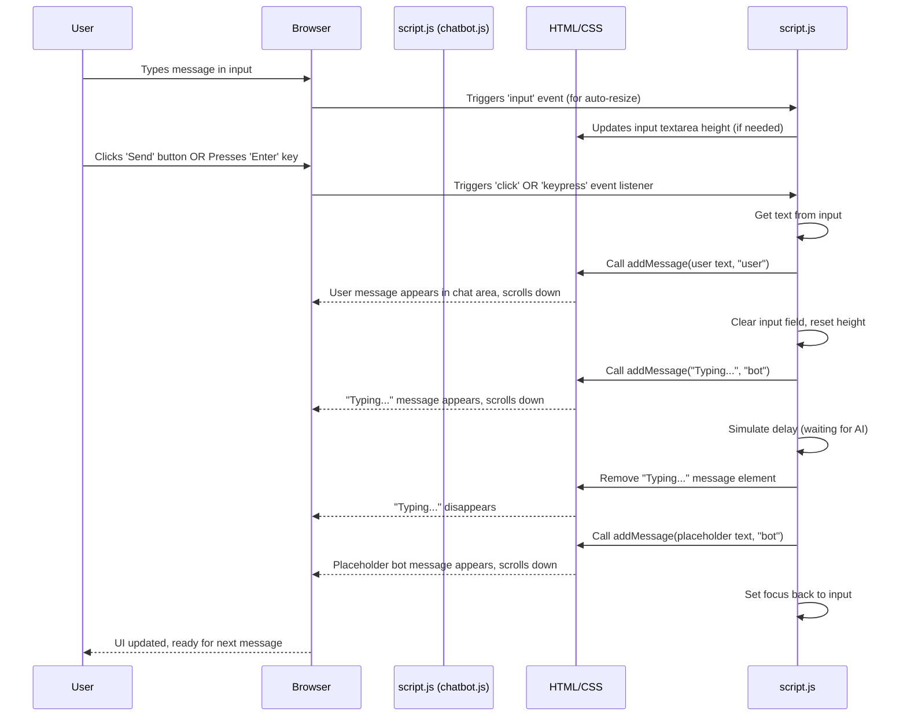

# Chapter 2: Chatbot UI & Interaction

Welcome back! In [Chapter 1: Dynamic Section Switching](01_dynamic_section_switching_.md), we learned how to dynamically show and hide different sections of a web page, making our site feel more interactive without needing full page reloads. We saw how HTML structure, CSS styling, and JavaScript working together can control what the user sees.

Now, we're going to apply and extend some of these ideas to build a key interactive feature of the portfolio: a chatbot!

## What is the Chatbot UI?

Think of your favorite messaging app – like WhatsApp, Slack, or even simple SMS. It has a window you open, a place where messages appear chronologically (from you and the other person), and an area at the bottom where you type your reply.

The **Chatbot UI & Interaction** concept in this project is about creating exactly that kind of interface, but for talking to an AI assistant on your portfolio. It's the visual part that the user sees and interacts with to have a conversation.

This abstraction is responsible for:

1.  **Showing and hiding** the entire chat window when the user wants to start or stop chatting.
2.  **Displaying** messages as they arrive, clearly showing who sent them (user or bot).
3.  **Providing a place** for the user to type their message (the input area).
4.  **Sending** the user's typed message when they hit a button or press Enter.

It's the *face* of the chatbot, managing the flow of the conversation on the screen.

## How Does the Chatbot UI Work?

Just like the dynamic section switching, the chatbot UI relies on the three core web technologies: HTML for structure, CSS for looks, and JavaScript for interactivity.

Let's look at the essential parts needed in the HTML (`index.html`) to make this happen:

```html
<!-- Somewhere visible on the page -->
<button id="chat-button">Open Chat</button>

<!-- The main chat window container, initially hidden -->
<div id="chat-window" class="hidden">
  <div class="chat-header">
    <span>AI Assistant</span>
    <button id="close-chat">&times;</button> <!-- The close button -->
  </div>
  <div id="chat-messages" class="chat-body">
    <!-- Messages will be added here by JavaScript -->
  </div>
  <div class="chat-input-area">
    <textarea id="chat-input" placeholder="Ask me about Jasper..."></textarea>
    <button id="send-message">Send</button>
  </div>
</div>
```

In this simplified structure:

*   `<button id="chat-button">`: This is the button the user clicks to open the chat.
*   `<div id="chat-window">`: This is the main container for the whole chat interface. Notice it has the `hidden` class. Just like in Chapter 1, this `hidden` class (likely defined in CSS) will make the element disappear (`display: none;`).
*   `<button id="close-chat">`: A button inside the window to close it.
*   `<div id="chat-messages">`: This is the area where all the conversation messages will appear, one after another.
*   `<textarea id="chat-input">`: This is where the user types their message. We use `<textarea>` instead of `<input type="text">` because it allows for multiple lines of text, which is handy for longer questions.
*   `<button id="send-message">`: The button to click after typing a message to send it.

The CSS would define how these elements look and how the `hidden` class works:

```css
/* Example CSS */
#chat-window {
  /* Add styles for positioning, background, borders, etc. */
  position: fixed; /* Make it stay in place */
  bottom: 20px;
  right: 20px;
  width: 300px; /* Example size */
  height: 400px;
  background-color: white;
  border: 1px solid #ccc;
  z-index: 1000; /* Make sure it's on top */
  display: flex; /* Use flexbox for layout */
  flex-direction: column;
}

.hidden {
  display: none; /* This is what hides the window */
}

#chat-messages {
  flex-grow: 1; /* Makes message area take up available space */
  overflow-y: auto; /* Adds scrollbar if messages overflow */
  padding: 10px;
}

.message {
  margin-bottom: 10px;
  padding: 8px;
  border-radius: 5px;
}

.message.user {
  background-color: #007bff; /* Example user message color */
  color: white;
  align-self: flex-end; /* Align user messages to the right */
}

.message.bot {
  background-color: #e9e9eb; /* Example bot message color */
  color: black;
  align-self: flex-start; /* Align bot messages to the left */
}

.chat-input-area {
  display: flex;
  padding: 10px;
  border-top: 1px solid #ccc;
}

#chat-input {
  flex-grow: 1; /* Make input take up available space */
  margin-right: 10px;
  padding: 8px;
  border: 1px solid #ccc;
  border-radius: 5px;
  resize: none; /* Disable manual resizing */
  max-height: 100px; /* Prevent it from growing too tall */
}
```

This CSS sets up the layout, adds some basic styling to messages (like colors and alignment based on the `.user` or `.bot` class we'll add with JavaScript), and crucially defines the `.hidden` class that controls visibility.

## Making it Interactive with JavaScript (`chatbot.js`)

The core logic for making the chat UI work resides in the `chatbot.js` file. It listens for user actions (clicks, typing) and updates the HTML/CSS accordingly.

Let's look at snippets from the `chatbot.js` file, focusing *only* on the UI interaction parts for now.

First, we get references to all the important HTML elements using their IDs:

```javascript
// --- File: chatbot.js (inside DOMContentLoaded listener) ---

  const chatButton = document.getElementById("chat-button");
  const chatWindow = document.getElementById("chat-window");
  const closeChat = document.getElementById("close-chat");
  const chatMessages = document.getElementById("chat-messages");
  const chatInput = document.getElementById("chat-input");
  const sendMessage = document.getElementById("send-message");

  // ... rest of the code
```

This code simply finds the elements we defined in our HTML structure and stores them in variables so we can easily work with them in JavaScript.

Next, we add listeners to handle opening and closing the window:

```javascript
// --- File: chatbot.js (inside DOMContentLoaded listener) ---

  // ... get element references

  // Toggle chat window on button click
  chatButton.addEventListener("click", () => {
    // This toggles the 'hidden' class on the chatWindow element
    chatWindow.classList.toggle("hidden");
    // If it's now visible, focus the input field
    if (!chatWindow.classList.contains("hidden")) {
      chatInput.focus();
    }
  });

  // Close chat window on close button click
  closeChat.addEventListener("click", () => {
    // This simply adds the 'hidden' class back
    chatWindow.classList.add("hidden");
  });

  // ... rest of the code
```

This is very similar to the [Dynamic Section Switching](01_dynamic_section_switching_.md) logic!
*   `chatButton.addEventListener("click", ...)`: When the element with `id="chat-button"` is clicked, the function inside runs.
*   `chatWindow.classList.toggle("hidden");`: This is the key. It checks if the `chatWindow` element has the `hidden` class. If it *does*, it removes it (making the window visible). If it *doesn't*, it adds it (making the window hidden).
*   The `if (!chatWindow.classList.contains("hidden")) { chatInput.focus(); }` line is a nice touch: if the window just became visible, it automatically puts the cursor in the typing area, ready for the user to type.
*   `closeChat.addEventListener("click", ...)`: When the element with `id="close-chat"` is clicked, it simply adds the `hidden` class back to the `chatWindow`, hiding it.

This takes care of making the window appear and disappear.

Now, how do we handle displaying messages? We have a function called `addMessage` for this:

```javascript
// --- File: chatbot.js ---

  // ... (other functions and listeners)

  // Add message to chat
  function addMessage(text, sender) {
    const messageDiv = document.createElement("div");
    // Add general 'message' class and a specific 'user' or 'bot' class
    messageDiv.classList.add("message", sender);

    // Process text for line breaks and URLs (simplified)
    const processedText = text
      .replace(/\n/g, "<br>"); // Convert newlines to HTML line breaks
      // (More complex URL processing is in the actual code)


    messageDiv.innerHTML = processedText; // Insert the text into the div
    chatMessages.appendChild(messageDiv); // Add the new div to the chat area

    // Smooth scroll to bottom after adding a message
    chatMessages.scrollTo({
      top: chatMessages.scrollHeight,
      behavior: "smooth",
    });

    return messageDiv; // Returns the created message element (useful for typing indicator)
  }

  // ... (rest of the code)
```

The `addMessage` function is reusable. It takes the message text and who sent it (`"user"` or `"bot"`).
1.  It creates a new `<div>` element in memory.
2.  It adds the basic `message` class and either the `user` or `bot` class. These classes are used by the CSS to style the message bubble (background color, alignment, etc.).
3.  It converts any newline characters (`\n`) in the text into HTML line break tags (`<br>`) so the message appears formatted correctly with line breaks in the browser. (The actual code also includes logic to automatically turn URLs into clickable links).
4.  It sets the processed text as the content of the new `div`.
5.  It adds this newly created `div` to the `chatMessages` element (the main message area in the HTML). `appendChild` puts it at the end, so new messages appear at the bottom.
6.  Finally, `chatMessages.scrollTo(...)` automatically scrolls the message area down so the user always sees the latest message.

Next, we need the logic for what happens when the user types and sends a message:

```javascript
// --- File: chatbot.js ---

  // ... (other functions and addMessage)

  // Send message function (simplified for UI only)
  async function sendMessageToBot() {
    const message = chatInput.value.trim(); // Get text from input, remove whitespace
    if (!message) return; // Don't send empty messages

    // Add user message to chat display
    addMessage(message, "user");

    // Clear the input field and reset its height
    chatInput.value = "";
    chatInput.style.height = "auto";

    // Show a "Typing..." indicator while waiting for the bot
    const typingIndicator = addMessage("Typing...", "bot");

    // --- THIS IS WHERE WE'D NORMALLY CALL THE AI API ---
    // We'll cover this in Chapter 4. For now, imagine it takes time.
    // try {
    //   const response = await generateResponse(message); // Call the AI!
    //   typingIndicator.remove(); // Remove "Typing..."
    //   addMessage(response, "bot"); // Add bot's actual response
    // } catch (error) {
    //   typingIndicator.remove();
    //   addMessage("Error...", "bot");
    // } finally {
         // Re-enable input and button (if they were disabled)
    //   chatInput.disabled = false;
    //   sendMessage.disabled = false;
    //   chatInput.focus();
    // }
     // For now, just simulate a delay and remove typing indicator
     await new Promise(resolve => setTimeout(resolve, 1000)); // Wait 1 second
     typingIndicator.remove();
     // Add a placeholder bot message
     addMessage("I received your message! (AI logic coming later)", "bot");
     chatInput.focus(); // Put cursor back
  }

  // Event listeners for sending messages
  sendMessage.addEventListener("click", sendMessageToBot); // Send button click

  chatInput.addEventListener("keypress", (e) => {
    if (e.key === "Enter" && !e.shiftKey) { // Send on Enter key, but not Shift+Enter
      e.preventDefault(); // Stop the default behavior (adding a newline in textarea)
      sendMessageToBot();
    }
  });

  // ... (rest of the code)
```

The `sendMessageToBot` function is triggered when the Send button is clicked or Enter is pressed in the input field.
1.  `chatInput.value.trim()` gets the text the user typed, removing any extra spaces at the beginning or end.
2.  If the message isn't empty, it calls `addMessage(message, "user")` to display the user's message in the chat window.
3.  It clears the input field (`chatInput.value = ""`) and resets its height.
4.  It adds a temporary message "Typing..." using `addMessage("Typing...", "bot")`. This gives the user feedback that the bot is working.
5.  **Important:** The code comments out the actual call to the AI (`generateResponse`) and the handling of the bot's real reply. For this chapter, we are *only* focusing on the UI. We add a small delay and then remove the typing indicator and add a placeholder bot message. The real AI communication will be covered in [Chapter 4: Gemini API Communication](04_gemini_api_communication_.md).
6.  Finally, it puts the cursor back in the input field, ready for the next message.

The two event listeners at the end hook this function up: one to the `click` event on the `sendMessage` button, and one to the `keypress` event on the `chatInput` textarea. The `keypress` listener checks if the pressed key is `Enter` *and* that the `Shift` key was *not* held down (because Shift+Enter usually means add a new line in a textarea). If it's a regular Enter, it prevents the default action (adding a newline) and calls `sendMessageToBot`.

There's also a handy bit of code to make the textarea grow as you type more lines, up to a certain point:

```javascript
// --- File: chatbot.js ---

  // ... (other code)

  // Auto-resize input field
  chatInput.addEventListener("input", function () {
    this.style.height = "auto"; // Reset height to calculate
    const maxHeight = 100; // Define max height
    const scrollHeight = this.scrollHeight; // Get the required height
    // Set height, but don't exceed max height
    this.style.height = Math.min(scrollHeight, maxHeight) + "px";
  });

  // ... (rest of the code)
```

This listener runs every time the content of the `chatInput` textarea changes. It cleverly sets the height back to `auto` (which lets the browser figure out the natural height needed for the content), gets that natural height (`scrollHeight`), and then sets the `height` style to either that natural height or `maxHeight` (100px), whichever is smaller. This prevents the input area from getting excessively tall.

## Under the Hood: UI Flow

Let's visualize the flow when a user sends a message, focusing only on the UI parts we've discussed:



This diagram shows how JavaScript reacts to user actions, manipulates the HTML structure by adding new message elements and changing CSS classes/styles, and provides visual feedback to the user ("Typing...").

## Conclusion

In this chapter, we explored the **Chatbot UI & Interaction**. We learned how HTML provides the structure for the chat window, message area, and input; how CSS styles these elements and uses a `hidden` class to control visibility; and how JavaScript ties it all together by listening for button clicks and input events, dynamically adding messages to the display, and managing the state of the UI (like showing/hiding the window and clearing the input). We saw how this builds upon the [Dynamic Section Switching](01_dynamic_section_switching_.md) concept from the previous chapter.

While we've built the *visual* and *interactive* shell of the chatbot, we haven't yet given it a brain! The "Typing..." indicator is just a placeholder, and the response is hardcoded. The real magic is in *what* the bot says and *how* it knows to say it.

In the next chapter, we'll dive into the concept of the bot's "memory" and "personality": [AI Persona & History](03_ai_persona___history_.md).

---

<sub><sup>Generated by [AI Codebase Knowledge Builder](https://github.com/The-Pocket/Tutorial-Codebase-Knowledge).</sup></sub> <sub><sup>**References**: [[1]](https://github.com/jasper890/portfolio-repo/blob/792af8364fb0f758e482ba1a7b7a882cfb0a3832/chatbot.js)</sup></sub>
