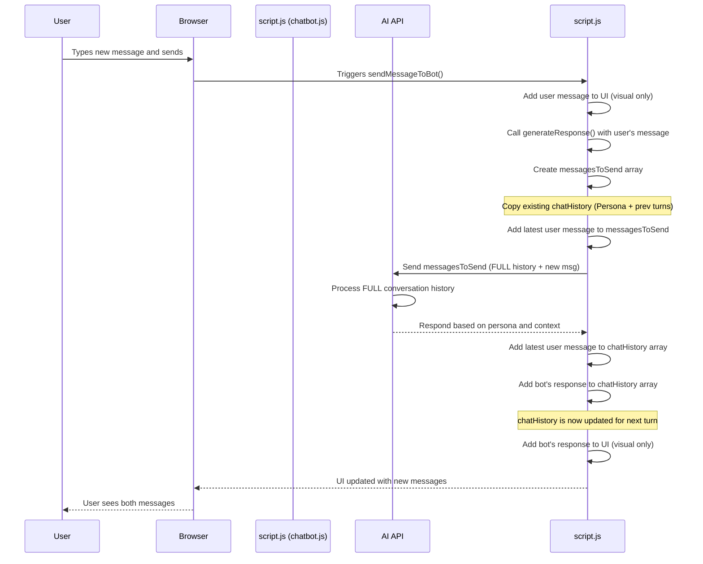

# Chapter 3: AI Persona & History

Welcome back, future web wizards! In our previous chapter, [Chatbot UI & Interaction](02_chatbot_ui___interaction_.md), we built the visual part of our chatbot – the window, the message area, and the input box. We learned how to make it appear and disappear and how to show messages on the screen.

But so far, our bot is like a puppet with no strings – it has a face, but it doesn't know *what* to say or *how* to say it. It needs a brain and a memory!

This is where the concept of **AI Persona & History** comes in. It's the behind-the-scenes magic that tells the AI:

1.  **Who it should be:** What personality it should have, what character it should play.
2.  **What it knows:** The background information it should use to answer questions.
3.  **What just happened:** The memory of the conversation so far.

Think of it like giving the AI a script and a short-term memory so it can understand the context and respond appropriately, specifically acting as "Jasper" based on the profile information.

## What is AI Persona & History?

In simple terms:

*   **Persona:** This is the set of instructions and background information that tells the AI *who* it is acting as. In our project, this is crucial because we want the AI to impersonate "Jasper" and talk about his skills, projects, and experience from a first-person perspective ("I built this," "My skills include..."). It's like giving an actor their character's backstory and motivations.
*   **History:** This is a record of the conversation so far. When you talk to a friend, you don't repeat everything you've said; they remember! Similarly, the AI needs to remember what was said earlier in the chat to understand follow-up questions, references to previous topics, or maintain the flow of the conversation.

Together, the Persona sets the stage and the History keeps the story going correctly.

## Why is This Important?

Without a Persona, the AI would give generic answers like any public chatbot. It wouldn't know about Jasper's specific NFC project or his preference for practical tools. The conversation would be meaningless for a portfolio site.

Without History, the AI would treat every new message as the very first one. If you asked, "Tell me about your NFC project," it might give a good answer. But if you then asked, "How is it used?", the AI wouldn't know "it" refers to the NFC project. It would lose the context instantly.

By providing both Persona and History, we enable the AI to act as "Jasper" and have a coherent, context-aware conversation about his work.

## How it Works: Setting the Stage (Persona)

The AI models we use don't inherently know how to be "Jasper." We have to *tell* them. We do this by sending them an initial set of messages that establish the role and provide the necessary background. This is often called a "system prompt" or, in the Gemini API structure we're using, it's part of the initial `chatHistory`.

Look at the `chatbot.js` file. You'll find a variable called `chatHistory`. When the page loads, it's not empty! It's pre-filled with messages that look like a conversation *we* had with the AI *before* the user even started typing.

```javascript
// --- File: chatbot.js ---
const chatHistory = [
  {
    role: "user", // Think of this as YOU giving instructions
    parts: [
      {
        text: `you are impersonating me as jasper you show case my work which is
so you are jasper you are here as my ai custom knowledge base assistant
... (Jasper's full profile text goes here) ...
`,
      },
    ],
  },
  {
    role: "model", // Think of this as the AI confirming it understands
    parts: [
      {
        text: `Here's a thinking process that leads to the Jasper impersonation:
... (AI's internal thought process - often sent to help guide it) ...`,
      },
      {
        text: `my name is jasper
... (AI confirms its role and summarizes the persona)...`,
      },
    ],
  },
  // ... more user/model messages defining specific behaviors (like contacts, girlfriend's name)
];
```

This `chatHistory` array starts with a sequence where a "user" (that's us, the developers) provides the AI with Jasper's complete profile text and tells it to impersonate him. The "model" (the AI) then ideally responds in a way that shows it understands the instructions and the persona.

The key user message here (`role: "user"`) contains the core instructions and the entire background text about Jasper's projects, skills, etc. This is the **Persona** definition. It tells the AI: "Act like Jasper, and here's all the information you need to know about his work."

Later messages in this initial history fine-tune the persona, adding specific rules like how to respond when asked "Who are you?" or "Who is your girlfriend?".

```javascript
// Example of a later part of the initial chatHistory defining a specific response
// --- File: chatbot.js (continuing the chatHistory array) ---
// ... (previous messages defining the main persona) ...
{
  role: "user",
  parts: [{ text: "When they ask about my contacts, show this:\n\nI'm here to walk you through..." }]
},
{
  role: "model",
  parts: [{ text: "Got it. I’ll use the following response whenever someone asks for my contact information..." }]
},
// ... etc.
```

By structuring these initial messages in `chatHistory`, we prime the AI with the persona and essential knowledge before the actual user conversation even begins.

## How it Works: Keeping the Memory (History)

Now, how does the AI remember what the *current* user is saying? Every time the user types a new message and hits "Send," we need to:

1.  Take the new user message.
2.  Add it to our `chatHistory` array.
3.  Send the *entire* `chatHistory` (including the new message) to the AI API.

When the AI receives the request, it looks at the *whole* history provided. It sees the initial persona instructions, all the previous user messages, and all its own previous responses, followed by the *latest* user message. This allows it to understand the context of the new message based on everything that came before.

Let's look at the `sendMessageToBot` and `generateResponse` functions in `chatbot.js`.

```javascript
// --- File: chatbot.js ---

  // ... (other code like addMessage function) ...

  // Initial Chat History (defined earlier)
  const chatHistory = [ ... ]; // Contains initial persona and background

  // Generate response using Gemini API with chat history
  async function generateResponse(prompt) {
    // 1. Create the list of messages to send to the API
    const messagesToSend = [
      ...chatHistory, // <-- Include the ENTIRE chatHistory so far
      { role: "user", parts: [{ text: prompt }] }, // <-- Add the LATEST user prompt
    ];

    // 2. Prepare and send the request to the AI API
    // (Details covered in Chapter 4)
    const response = await fetch(`${API_URL}?key=${API_KEY}`, {
      method: "POST",
      headers: { "Content-Type": "application/json" },
      body: JSON.stringify({ contents: messagesToSend }), // Send the FULL history
    });

    // ... (handle response and extract bot text) ...

    const botResponse = cleanMarkdown(data.candidates[0].content.parts[0].text);

    // 3. Update chat history with the NEW messages
    chatHistory.push({ role: "user", parts: [{ text: prompt }] }); // Add the user's message
    chatHistory.push({ role: "model", parts: [{ text: botResponse }] }); // Add the bot's response

    return botResponse;
  }

  // Send message function (simplified)
  async function sendMessageToBot() {
    const message = chatInput.value.trim();
    if (!message) return;

    // ... (add user message to UI, show typing indicator) ...

    try {
      const response = await generateResponse(message); // Call the function that sends history
      // ... (remove typing indicator, add bot message to UI) ...
    } catch (error) {
      // ... (handle error) ...
    } finally {
      // ... (re-enable input) ...
    }
  }

  // ... (event listeners for send button/enter key) ...
```

Let's trace what happens in these snippets:

1.  When the user clicks "Send" or presses Enter, the `sendMessageToBot` function is called.
2.  It gets the user's message text.
3.  It calls `generateResponse`, passing the user's message (`prompt`).
4.  Inside `generateResponse`:
    *   It creates a *new* array `messagesToSend`.
    *   Crucially, it copies *all* the messages from the existing `chatHistory` array into `messagesToSend` using the `...chatHistory` syntax (this is called the spread syntax).
    *   It then adds the *latest* user message (`{ role: "user", parts: [{ text: prompt }] }`) to the end of `messagesToSend`.
    *   This complete `messagesToSend` array (Persona + full conversation history + latest message) is sent to the AI API.
5.  The AI processes this full history and generates a relevant response, acting in character.
6.  Back in `generateResponse`, after getting the bot's response:
    *   It adds the *latest* user message to the *actual* `chatHistory` array using `chatHistory.push(...)`.
    *   It adds the bot's response to the *actual* `chatHistory` array using `chatHistory.push(...)`.
7.  The `chatHistory` variable is now updated with the full, latest conversation, ready for the next turn.

This process repeats with every user message, constantly building the `chatHistory` and sending the whole thing back to the AI, allowing it to maintain context and stay in character.

## Under the Hood: Message Flow with History

Let's visualize the flow when a user sends a message *after* the conversation has already started, focusing on how history is managed:



This diagram shows how `script.js` acts as the manager, constantly updating and sending the conversation history so the AI always has the necessary context.

## Conclusion

In this chapter, we peeled back the curtain on the "brain" and "memory" of our chatbot: **AI Persona & History**. We learned that the Persona is established by initial instructions in the `chatHistory` array, telling the AI *who* to be (Jasper) and *what* it knows (his profile). We also saw how the conversation History is maintained by adding each new message to the `chatHistory` array and sending the *entire* updated history with every request to the AI. This allows the AI to understand context and stay in character throughout the conversation.

Now that we understand *what* information is sent to the AI and *how* its identity and memory are managed, the next logical step is to see *how* our code actually talks to the AI service over the internet. In the next chapter, we'll explore the [Gemini API Communication](04_gemini_api___communication.md).

---

<sub><sup>Generated by [AI Codebase Knowledge Builder](https://github.com/The-Pocket/Tutorial-Codebase-Knowledge).</sup></sub> <sub><sup>**References**: [[1]](https://github.com/jasper890/portfolio-repo/blob/792af8364fb0f758e482ba1a7b7a882cfb0a3832/chatbot.js)</sup></sub>
