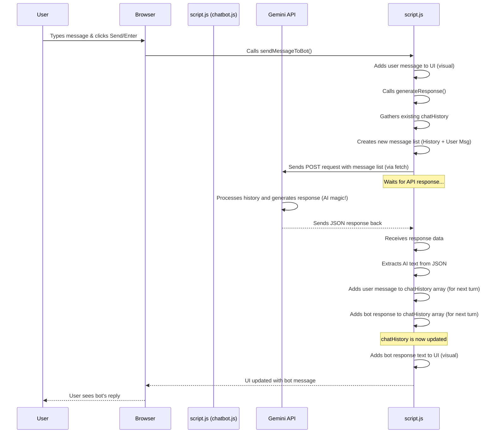

# Chapter 4: Gemini API Communication

Welcome back! In the last chapter, [AI Persona & History](03_ai_persona___history_.md), we gave our chatbot a personality (Jasper) and a memory (the conversation history). We saw how we store the ongoing chat in the `chatHistory` variable so the bot remembers what's been said.

But storing the history and setting a persona only prepares the information. It doesn't actually make the AI *think* and generate a response based on that information. For that, we need to talk to a powerful AI service somewhere out on the internet.

This is where the **Gemini API Communication** comes in. It's the part of our code that acts like a messenger, taking the user's message and the conversation history, sending it to a smart AI service (Google's Gemini), and then bringing the AI's reply back to our website.

## What is Gemini API Communication?

Imagine you've written a detailed letter (the user's message) to a brilliant expert (the Gemini AI service) asking for advice. To give you the *best* advice, the expert needs to see your *previous* letters too (the conversation history) so they understand the background.

The **Gemini API Communication** layer is like:

1.  Gathering your new letter and all the old letters together.
2.  Putting them in an envelope addressed to the expert.
3.  Sending that envelope through a special high-speed postal service (the internet) to the expert's office (the Gemini API server).
4.  Waiting for the expert to read everything and write a reply.
5.  Receiving the expert's reply through the same postal service.
6.  Delivering the reply back to you (displaying it in the chat UI).

It's the bridge connecting the user interface and stored chat history on your website to the actual AI "brain" that generates the responses.

## How Do We Talk to the AI?

Websites talk to external services like the Gemini API using something called an **API** (Application Programming Interface). Think of an API as a standardized way for different computer programs to communicate with each other. It defines the rules and formats for sending requests and receiving responses.

In web development, we often use the `fetch` function in JavaScript to send requests over the internet to an API endpoint (a specific web address for the API). The Gemini API has such an endpoint specifically for sending chat messages and getting responses.

The `generateResponse` function in our `chatbot.js` file is responsible for this communication. It takes the user's latest message and handles the process of sending it, along with the history, to the Gemini API.

## Preparing the Message for the AI

Before we send our "letter" (the user's message) and "previous letters" (the `chatHistory`), we need to format them exactly how the Gemini API expects. The API needs the conversation history as a list of messages, where each message specifies who sent it (`role: "user"` or `role: "model"`) and the content (`parts: [{ text: "..." }]`).

We already saw in [Chapter 3: AI Persona & History](03_ai_persona___history_.md) that our `chatHistory` variable is already in this format, including the initial messages that set the persona.

When a user sends a *new* message, the `generateResponse` function creates a list of messages to send to the API by combining the existing `chatHistory` with the latest user message:

```javascript
// --- File: chatbot.js (inside generateResponse function) ---

async function generateResponse(prompt) {
  // ... (API Key and URL setup) ...

  // Combine the existing history with the latest user message
  const messagesToSend = [
    ...chatHistory, // Copy all messages from the chatHistory array
    { role: "user", parts: [{ text: prompt }] }, // Add the latest user message
  ];

  // ... (rest of the function handles sending and receiving)
}
```

Here:
*   `chatHistory` is the array holding the entire conversation so far, including the persona setup.
*   `...chatHistory` is JavaScript's "spread syntax". It effectively takes all the items *out* of the `chatHistory` array and puts them *directly* into our new `messagesToSend` array.
*   `{ role: "user", parts: [{ text: prompt }] }` creates an object representing the user's *current* message in the format the API expects.
*   So, `messagesToSend` becomes a single array containing: Persona messages + previous chat turns + the current user message. This is the complete context sent to the AI.

## Sending the Request

Now that we have the `messagesToSend` formatted correctly, we use the `fetch` API to send it. This involves specifying the API's web address (`API_URL`), our unique key to access the service (`API_KEY`), the type of request (`POST`), and the data we are sending.

```javascript
// --- File: chatbot.js (inside generateResponse function) ---

  const API_KEY = "YOUR_ACTUAL_API_KEY"; // Get this from Google AI Studio or Cloud
  const API_URL = "https://generativelanguage.googleapis.com/v1beta/models/gemini-1.5-flash-latest:generateContent";

  const messagesToSend = [ ... ]; // As created in the previous step

  const response = await fetch(`${API_URL}?key=${API_KEY}`, {
    method: "POST", // We are sending data
    headers: {
      "Content-Type": "application/json", // Telling the API we're sending JSON
    },
    body: JSON.stringify({ // Convert our JavaScript object to a JSON string
      contents: messagesToSend, // The API expects the message list under 'contents'
    }),
  });

  // ... (rest of the function handles the response)
```

Let's break this down:
*   `API_KEY` and `API_URL` are constants holding the necessary credentials and address. **Remember to replace `"YOUR_ACTUAL_API_KEY"` with a real key obtained from Google!**
*   `fetch(...)` initiates the request. The first argument is the URL (including our API key as a query parameter).
*   The second argument is an object configuring the request:
    *   `method: "POST"`: Standard for sending data to be processed.
    *   `headers: { "Content-Type": "application/json" }`: Tells the API that the data in the `body` is in JSON format.
    *   `body: JSON.stringify({ contents: messagesToSend })`: This is the actual data being sent.
        *   We create a JavaScript object `{ contents: messagesToSend }`. The Gemini API expects the list of messages to be inside a property named `contents`.
        *   `JSON.stringify(...)` converts this JavaScript object into a JSON formatted *string*, which is the standard way to send structured data over the web.

After calling `fetch`, the code uses `await` because sending data over the internet takes time. The code "pauses" here until the response comes back.

## Receiving the Response

Once the Gemini API has processed the request and generated a response based on the history and prompt, it sends the response back to our website. The response comes back as a stream of data, which we typically convert into a JavaScript object using `.json()`.

```javascript
// --- File: chatbot.js (inside generateResponse function) ---

  // ... (fetch call from previous step) ...

  if (!response.ok) {
    // If the response status is not OK (e.g., 400, 500), something went wrong
    throw new Error("Failed to generate response: " + response.status);
  }

  // Convert the received data from the API into a JavaScript object
  const data = await response.json();

  // The AI's text response is nested deep inside the response object
  const botResponse = data.candidates[0].content.parts[0].text;

  // Optional: Clean up any markdown formatting symbols
  const cleanedResponse = cleanMarkdown(botResponse);

  // ... (update chat history, return response) ...

  return cleanedResponse;
```

Here's what happens after the `fetch` call finishes:
*   `if (!response.ok)` checks if the request was successful. If the status code (like 200 OK) indicates success, `.ok` is true. Otherwise, we throw an error.
*   `const data = await response.json();` waits for the response body to be fully received and then parses the JSON string into a usable JavaScript object stored in the `data` variable.
*   `const botResponse = data.candidates[0].content.parts[0].text;` is how we extract the actual text generated by the AI from the potentially complex `data` object structure that the API returns. This path (`data.candidates[0].content.parts[0].text`) is specific to the Gemini API response format.
*   `cleanMarkdown(botResponse)` is a small helper function (defined elsewhere in `chatbot.js`) that removes some common Markdown formatting symbols (like `**` for bold or `#` for headings) that we might not want in our simple chat display.
*   Finally, the cleaned text is returned by the `generateResponse` function.

Back in the `sendMessageToBot` function, this returned text is then passed to the `addMessage` function (which we learned about in [Chapter 2: Chatbot UI & Interaction](02_chatbot_ui___interaction_.md)) to display it in the chat window.

## Under the Hood: The Communication Flow

Let's put it all together to see the step-by-step flow when a user sends a message and the AI responds:



This diagram shows how `script.js` orchestrates the communication: preparing the data, sending it to the external API, waiting, receiving the result, and then using that result to update both the internal memory (`chatHistory`) and the visual display (`addMessage`).

## Conclusion

In this chapter, we learned about **Gemini API Communication**, the essential link that allows our chatbot UI and history to connect with the powerful AI model. We saw how JavaScript's `fetch` function is used to send the formatted conversation history (including persona and the latest user message) as a `POST` request to the Gemini API endpoint, along with an API key for authentication. We also learned how to receive the API's JSON response and extract the actual text generated by the AI to display it in the chat.

Now that our chatbot can think and talk, what other dynamic information could we pull into our portfolio? In the next chapter, we'll explore how to fetch data from another external service: [GitHub Contributions Fetch](05_github_contributions_fetch_.md).

---
