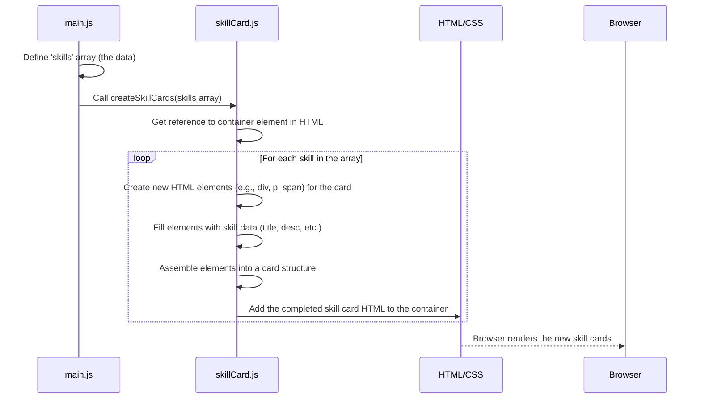
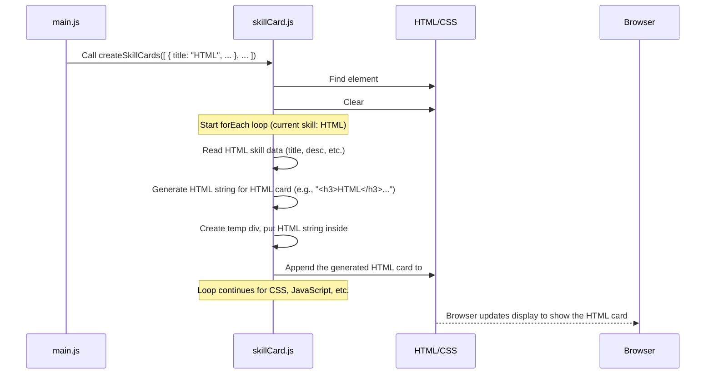

# Chapter 6: Skill Data & Display

Welcome back! In our previous chapter, [GitHub Contributions Fetch](05_github_contributions_fetch_.md), we learned how to reach out to an external service (GitHub) and pull specific data onto our page using APIs and the `fetch` function. This showed us how dynamic content can come from beyond our own code files.

Now, we'll look at handling data that lives *within* our project and how to use that data to build and display parts of our page automatically. Specifically, we'll focus on showing off your skills!

## What is Skill Data & Display?

Imagine you have a list of skills you want to show on your portfolio: HTML, CSS, JavaScript, Python, etc. For each skill, you probably want to show:

*   The skill's **name** (like "HTML")
*   A brief **description** of what that skill involves
*   Maybe a **percentage** or **level** to indicate your proficiency

You *could* manually write the HTML code for each skill card, one by one. But what if you have many skills? What if you want to change the layout slightly? You'd have to edit the HTML for *every single skill card*. That sounds like a lot of repetitive work!

The **Skill Data & Display** concept solves this. It breaks the problem into two parts:

1.  **Skill Data:** We organize all the information about your skills (name, description, percentage, etc.) in a structured list within a JavaScript file. This list is the "ingredients."
2.  **Skill Display:** We write a single piece of code (a function) that knows how to read this list of ingredients and automatically generate the HTML code needed to show each skill as a nicely formatted card on the page. This function is the "recipe" or the "card-baking factory."

It's like having a clean shopping list (the data) and a smart machine (the function) that takes the list and builds everything you need, rather than manually assembling each item from scratch.

## Why Separate Data from Display?

Separating the "what" (the data) from the "how to show it" (the display logic) is a core principle in programming. For our skills, it gives us big advantages:

*   **Easy Updates:** To add, remove, or change a skill, you just edit the data list. You don't touch the HTML structure.
*   **Consistency:** The display function ensures every skill card looks the same because it uses the same "recipe" for each one.
*   **Reusability:** If you wanted to display skills in a different part of the page later, you could reuse the same data and potentially the same or a slightly modified display function.

## How it Works: The Basic Flow

Here's the simple process:

1.  You create a JavaScript array (a list) containing objects. Each object holds the details for one skill.
2.  When the page loads, your main script imports the display function.
3.  The main script calls the display function and gives it the skill data array.
4.  The display function loops through each skill in the array.
5.  For each skill, it creates the necessary HTML elements and fills them with the skill's specific details.
6.  It then adds these newly created HTML elements to a designated spot on your webpage.



This diagram shows that `main.js` provides the raw data, `skillCard.js` contains the logic (`createSkillCards`) to process that data and build the HTML, and finally, the HTML is updated to show the result.

## Defining the Skill Data (`main.js`)

Let's look at the `skills` array defined in `main.js`. This is where our "ingredients" list lives.

```javascript
// --- File: main.js ---
import "style.css";
import { createSkillCards } from "skillCard.js";

document.querySelector("#app").innerHTML = "";

// Define skill data - This is our list of 'ingredients'
const skills = [
  { // This is the first skill object
    id: 1,
    title: "HTML",
    description: "Building structured and semantic web pages",
    image: "...", // Placeholder for image URL
    percentage: 90,
    level: "advanced",
  },
  { // This is the second skill object
    id: 2,
    title: "CSS",
    description: "Styling and responsive web design",
    image: "...", // Placeholder for image URL
    percentage: 85,
    level: "advanced",
  },
  { // This is the third skill object
    id: 3,
    title: "JavaScript",
    description: "Interactive web development and DOM manipulation",
    image: "...", // Placeholder for image URL
    percentage: 80,
    level: "intermediate",
  },
  // ... potentially more skill objects here
];

// Create skill cards - Call the 'recipe' function
createSkillCards(skills);
```

*   `const skills = [...];`: This declares a constant variable named `skills` and assigns it an array (`[]`).
*   Inside the array, `{...}` represents individual JavaScript objects. Each object describes *one* skill.
*   Each object has properties like `title`, `description`, `percentage`, and `level`. These properties hold the specific details for that skill. We give them meaningful names so we know what each piece of data is for.
*   `createSkillCards(skills);`: After defining the data, this line calls the function that will process this `skills` array and display the cards.

To add a new skill, you would simply add another object to this `skills` array! To update a skill, you find its object in the array and change its properties. Easy!

## The Display Function (`skillCard.js`)

The `createSkillCards` function is our "card-baking factory." It takes the `skills` array as input and outputs HTML on the page. This function lives in the `skillCard.js` file.

```javascript
// --- File: skillCard.js ---

// This function takes the list of skills and creates HTML cards
export function createSkillCards(skillsData) { // Accepts the skills array as input
  // 1. Find the container where the cards should go
  const container = document.getElementById("skill-cards-container"); // Make sure you have a div with this ID in index.html

  if (!container) {
    console.error("Skill cards container element not found!");
    return; // Stop if the container doesn't exist
  }

  container.innerHTML = ""; // Clear any existing content in the container

  // 2. Loop through each skill in the input array
  skillsData.forEach(skill => { // 'skill' variable represents the current skill object in the loop

    // 3. Create the HTML structure for one skill card
    const cardHtml = `
      <div class="skill-card">
        <h3>${skill.title}</h3> <!-- Use the skill's title -->
        <p>${skill.description}</p> <!-- Use the skill's description -->
        <div class="progress-bar">
          <div class="progress" style="width: ${skill.percentage}%;"></div> <!-- Use the skill's percentage for width -->
        </div>
        <span>Level: ${skill.level}</span> <!-- Use the skill's level -->
      </div>
    `;

    // 4. Create a new HTML element to hold this card's HTML
    const cardElement = document.createElement("div");
    cardElement.innerHTML = cardHtml; // Set the HTML content

    // 5. Add the new card element to the container on the page
    container.appendChild(cardElement.firstElementChild); // Append the first child (the .skill-card div)
  });
}
```

Let's break this down:

1.  `export function createSkillCards(skillsData) { ... }`: This defines the function. `export` makes it available to be imported in `main.js`. It accepts one argument, which we've named `skillsData` (this is where the `skills` array from `main.js` will arrive).
2.  `const container = document.getElementById("skill-cards-container");`: This line finds a specific HTML element on the page using its ID. This element is where all the generated skill cards will be placed. You need to make sure you have a `<div id="skill-cards-container"></div>` (or similar) in your `index.html` file where you want the skills to appear.
3.  `container.innerHTML = "";`: This clears anything that might have been inside the container previously. This is good practice to prevent duplicate cards if the function were called multiple times.
4.  `skillsData.forEach(skill => { ... });`: This is a loop that goes through *each* item in the `skillsData` array. In each turn of the loop, the current skill object (like the HTML skill, then the CSS skill, etc.) is assigned to the variable `skill`.
5.  `const cardHtml = `...`;`: Inside the loop, this line creates a string of HTML code for *one* skill card. Notice the backticks `` ` `` which allow us to create a multi-line string and easily embed JavaScript variables using `${variableName}` syntax. This is where we insert the data from the current `skill` object (`skill.title`, `skill.description`, `skill.percentage`, `skill.level`) directly into the HTML structure.
6.  `const cardElement = document.createElement("div");` and `cardElement.innerHTML = cardHtml;`: We create a temporary `div` element in memory and put the generated `cardHtml` string inside it. This is a common trick to easily convert an HTML string into actual, usable HTML elements.
7.  `container.appendChild(cardElement.firstElementChild);`: Finally, we take the first child element from our temporary `cardElement` (which is the `<div class="skill-card">` we created in the string) and add it to the `container` element on the actual web page.

After the loop finishes, the `skill-cards-container` div in your HTML will be filled with a `skill-card` div for each skill that was in your `skills` array, each populated with the correct data.

The CSS would then style elements with the class `skill-card`, `progress-bar`, and `progress` to make them look visually appealing.

## Under the Hood: The Card Factory Process

Let's trace the process for just the first skill ("HTML") when `createSkillCards(skills)` is called:



This highlights how the function iterates through the data, uses it to build a piece of HTML, and adds that piece to the live page for *each* item in the list.

## Conclusion

In this chapter, we explored **Skill Data & Display**. We learned the importance of separating your content (the skill details in the `skills` array in `main.js`) from the logic that displays it (the `createSkillCards` function in `skillCard.js`). We saw how this function iterates through the data array, dynamically creates HTML elements for each item, injects the specific data into those elements using template strings, and adds the resulting structure to the webpage. This is a fundamental pattern for handling lists of items in web development and making your code more maintainable.

Now that we've seen how to manage and display structured data, let's look at another common UI feature: allowing users to switch between different visual styles, like a light and dark mode. In the next chapter, we'll delve into [Theme Toggling (Dark/Light Mode)](07_theme_toggling__dark_light_mode__.md).

---

<sub><sup>Generated by [AI Codebase Knowledge Builder](https://github.com/The-Pocket/Tutorial-Codebase-Knowledge).</sup></sub> <sub><sup>**References**: [[1]](https://github.com/jasper890/portfolio-repo/blob/792af8364fb0f758e482ba1a7b7a882cfb0a3832/main.js)</sup></sub>
