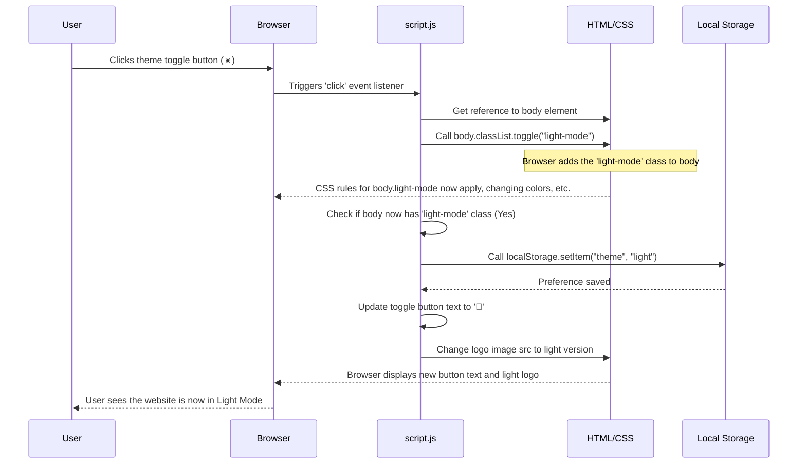

# Chapter 7: Theme Toggling (Dark/Light Mode)

Welcome back, coding adventurers! In our last chapter, [Skill Data & Display](06_skill_data___display_.md), we learned how to store information (like your skills) separately from how it's shown on the page, making our website easier to update. We saw how JavaScript can read data and dynamically build HTML elements to display it.

Now, let's shift our focus to another way we can make the website dynamic and user-friendly: changing its entire look and feel with a single click! This chapter is all about **Theme Toggling (Dark/Light Mode)**.

## What is Theme Toggling?

Have you ever used an app or website that lets you switch between a bright, standard look (light mode) and a darker, often more comfortable-for-the-eyes look (dark mode)? That's theme toggling!

It's like having a light switch for your website. When you flip the switch, everything changes – the background color, the text color, maybe even some images or icons.

The **Theme Toggling (Dark/Light Mode)** system in this project does exactly this. It allows visitors to choose their preferred visual theme. Even better, it remembers their choice for their next visit, so they don't have to switch it back every time!

This concept handles:

1.  **Changing Styles:** Instantly swapping between different sets of colors and styles.
2.  **Remembering Preference:** Saving the user's last chosen theme (dark or light) in their browser.
3.  **Applying on Load:** Checking the saved preference when the page first loads and setting the theme accordingly.
4.  **Image Switching:** Sometimes, certain images (like logos) look better in one theme than the other, so the system can swap those too.

It gives users control over their viewing experience and makes the portfolio more accessible and comfortable for different lighting conditions or personal preferences.

## How Does Theme Toggling Work?

To make the entire website's appearance change like this, we need to coordinate HTML, CSS, and JavaScript again, along with a new tool: **Local Storage**.

1.  **HTML:** We need a button or toggle element that the user can click. We also need a way to target the main parts of the page whose styles will change – usually, we add a special class to the `<body>` tag or a main container `div`.
    ```html
    <!-- In index.html, perhaps near the header -->
    <button id="modeToggle">☀️</button>

    <!-- All your page content is inside the body tag -->
    <body class="initial-theme">
        <!-- ... your page content ... -->
    </body>
    ```
    Here, `id="modeToggle"` gives us a way to find the button in JavaScript. The `<body class="initial-theme">` is where we'll add or remove a class like `light-mode` to signal the current theme.

2.  **CSS:** This is where we define what the website looks like in *both* themes. We write standard CSS rules for the default (dark) theme. Then, we write *additional* rules that *only* apply when the `<body>` element (or main container) has a specific class, like `.light-mode`. These rules override the default styles.
    ```css
    /* style.css - Default (Dark) Mode Styles */
    body {
        background-color: #1e1e1e; /* Dark background */
        color: #ffffff; /* Light text */
    }

    h1, h2, h3 {
        color: #bb86fc; /* Example highlight color */
    }

    /* style.css - Light Mode Styles - These apply ONLY when body has class 'light-mode' */
    body.light-mode {
        background-color: #ffffff; /* Light background */
        color: #000000; /* Dark text */
    }

    body.light-mode h1,
    body.light-mode h2,
    body.light-mode h3 {
        color: #03dac6; /* Different highlight color */
    }

    /* Example: Maybe borders change too */
    .card {
        border: 1px solid #ffffff33; /* Subtle white border in dark mode */
    }

    body.light-mode .card {
        border: 1px solid #00000033; /* Subtle black border in light mode */
    }
    ```
    By adding `body.light-mode` before a selector, we make that style rule *more specific*. The browser prioritizes the more specific rule when the `body` element has the `light-mode` class, effectively switching the appearance.

3.  **JavaScript:** This provides the interactivity and memory. It:
    *   Listens for clicks on the theme toggle button.
    *   When clicked, it adds or removes the `.light-mode` class on the `<body>` element.
    *   It updates the button's text or icon to reflect the *new* theme.
    *   It saves the chosen theme ("dark" or "light") in **Local Storage** so the browser remembers it.
    *   When the page loads, it checks Local Storage first to see if a preference is saved and sets the initial theme accordingly *before* the user clicks anything.

4.  **Local Storage:** This is a small space in the user's web browser where websites can store simple information (like strings of text). This information persists even after the user closes the browser and reopens it later. It's perfect for remembering settings like theme preference.
    *   `localStorage.setItem("key", "value")`: Saves a value under a specific key.
    *   `localStorage.getItem("key")`: Retrieves the value saved under that key.
    *   `localStorage.removeItem("key")`: Deletes the saved value.

## Making it Dynamic with JavaScript (`script.js`)

Let's look at the relevant part of the `script.js` file that handles the theme toggling. This code runs when the page is ready (`DOMContentLoaded`).

```javascript
// --- File: script.js (inside DOMContentLoaded listener) ---

  const toggleButton = document.getElementById("modeToggle"); // Get the button
  const body = document.body; // Get the body tag
  const logo = document.getElementById("logo"); // Get logo 1
  const logo2 = document.getElementById("logo2"); // Get logo 2

  // --- Check for saved theme preference on page load ---
  // Get the saved theme from Local Storage
  const savedTheme = localStorage.getItem("theme");

  if (savedTheme === "light") {
    // If the saved theme is 'light', add the 'light-mode' class to the body
    body.classList.add("light-mode");
    // Update the button text/icon to show it's currently in light mode (option to switch to dark)
    toggleButton.textContent = "🌙";
     // Update image sources for light mode
    if (logo) logo.src = "Images/jrn-lightmode.png";
    if (logo2) logo2.src = "Images/jrn-lightmode.png";
  } else {
    // If no theme is saved, or it's 'dark', ensure default (dark) mode is active
    // (By default, body doesn't have light-mode class)
    // Update the button text/icon to show it's currently in dark mode (option to switch to light)
    toggleButton.textContent = "☀️";
     // Update image sources for dark mode (assuming this is default)
    if (logo) logo.src = "Images/jrn-dark.png";
    if (logo2) logo2.src = "Images/jrn-dark.png";
  }

  // --- Listen for clicks on the toggle button ---
  toggleButton.addEventListener("click", function () {
    // Toggle the 'light-mode' class on the body.
    // If it has the class, remove it. If it doesn't, add it.
    body.classList.toggle("light-mode");

    // --- Update Local Storage, button text, and images based on the NEW theme ---
    if (body.classList.contains("light-mode")) {
      // If body NOW has 'light-mode' (meaning we just switched TO light mode)
      localStorage.setItem("theme", "light"); // Save 'light' preference
      toggleButton.textContent = "🌙"; // Show moon icon (click for dark)
      if (logo) logo.src = "Images/jrn-lightmode.png"; // Change logo to light version
      if (logo2) logo2.src = "Images/jrn-lightmode.png"; // Change logo2 to light version
    } else {
      // If body NOW does NOT have 'light-mode' (meaning we just switched TO dark mode)
      localStorage.setItem("theme", "dark"); // Save 'dark' preference
      toggleButton.textContent = "☀️"; // Show sun icon (click for light)
      if (logo) logo.src = "Images/jrn-dark.png"; // Change logo to dark version
      if (logo2) logo2.src = "Images/jrn-dark.png"; // Change logo2 to dark version
    }
  });

  // ... (rest of your script.js code, like dynamic section switching) ...
```

Let's break this theme-toggling code down:

1.  `const toggleButton = ...; const body = ...;`: These lines get references to the HTML elements we need to interact with: the button that triggers the change and the `body` tag where we'll apply the theme class. We also get references to any images (`logo`, `logo2`) that need to change with the theme.
2.  `const savedTheme = localStorage.getItem("theme");`: When the page loads, this line checks if the browser's Local Storage has an item stored under the key `"theme"`. If the user visited before and toggled the theme, this will return `"light"` or `"dark"`. If they've never toggled it, it will return `null`.
3.  `if (savedTheme === "light") { ... } else { ... }`: This block runs *only* when the page loads. It checks the `savedTheme`. If it's `"light"`, it immediately adds the `light-mode` class to the body, sets the button text/icon to indicate the current theme is light (ready to switch *back* to dark), and updates the image sources to the light versions. If `savedTheme` is not `"light"` (either `"dark"` or `null`), it does nothing to the body class (leaving it in the default dark mode), sets the button text/icon for dark mode, and ensures the dark mode images are shown. This makes sure the website loads in the user's last chosen theme.
4.  `toggleButton.addEventListener("click", function () { ... });`: This sets up the interactivity for when the user clicks the button.
5.  `body.classList.toggle("light-mode");`: This is the core of the visual switch. `classList.toggle()` is a convenient JavaScript method. It checks if the `body` element currently has the class `"light-mode"`. If it does, it *removes* the class. If it doesn't, it *adds* the class. This single line flips the state that the CSS uses to apply styles.
6.  `if (body.classList.contains("light-mode")) { ... } else { ... }`: After toggling the class, we check if the `body` *now* has the `light-mode` class. This tells us which theme we just switched *to*.
7.  `localStorage.setItem("theme", "light");` or `localStorage.setItem("theme", "dark");`: Based on which theme we switched to, we update the `"theme"` item in Local Storage, saving the user's preference for their next visit.
8.  `toggleButton.textContent = "...";`: We update the button's text/icon (☀️ or 🌙) to show what clicking it *next* will do (switch to the *other* theme).
9.  `if (logo) logo.src = "...";`: If we have logo images, we update their `src` attribute to point to the appropriate image file for the newly active theme. The `if (logo)` check is good practice in case the element isn't found on a particular page.

This script effectively makes the theme switch live when the button is clicked *and* ensures the preference is remembered and applied every time the user visits the page.

## Under the Hood: Theme Switch Flow

Let's visualize what happens when a user clicks the theme toggle button, assuming they were in dark mode and switch to light:



This diagram shows how a single click triggers JavaScript, which manipulates a CSS class on a key HTML element. This class change, combined with predefined CSS rules, makes the entire page's style change. Simultaneously, JavaScript updates the button's look, potentially swaps images, and saves the choice in Local Storage for the future.

## Conclusion

In this chapter, we tackled **Theme Toggling (Dark/Light Mode)**. We learned how to create different visual styles using CSS classes (like `.light-mode`) that override default styles. We saw how JavaScript listens for user clicks on a toggle button and uses `classList.toggle()` to apply or remove these theme classes on the `<body>` tag, instantly switching the appearance. Crucially, we learned how to use the browser's `localStorage` to save the user's theme preference and check for it when the page loads, ensuring the website remembers their choice. We also briefly touched upon changing specific elements like images based on the active theme.

This ability to dynamically change the appearance adds a layer of personalization and accessibility to the portfolio.

Ready to explore another interactive visual element? In the next chapter, we'll look at how to implement an **Image Gallery / Modal** to display images in a user-friendly way: [Image Gallery / Modal](08_image_gallery___modal_.md).

---

<sub><sup>Generated by [AI Codebase Knowledge Builder](https://github.com/The-Pocket/Tutorial-Codebase-Knowledge).</sup></sub> <sub><sup>**References**: [[1]](https://github.com/jasper890/portfolio-repo/blob/792af8364fb0f758e482ba1a7b7a882cfb0a3832/script.js)</sup></sub>
