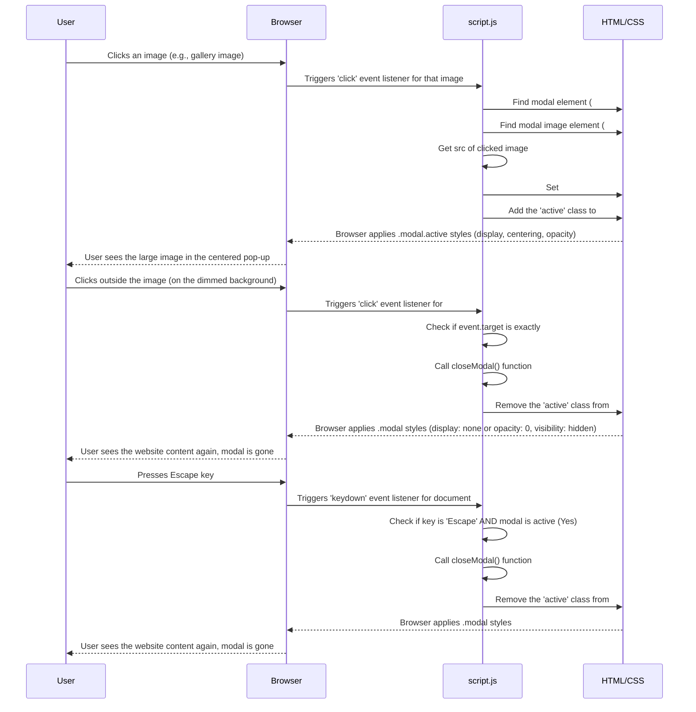

# Chapter 8: Image Gallery / Modal

Welcome back for our final concept chapter! In our last chapter, [Theme Toggling (Dark/Light Mode)](07_theme_toggling__dark_light_mode__.md), we saw how JavaScript and CSS can work together to change the entire visual style of the website, adding personalization and accessibility.

Now, let's look at a common interactive element that focuses on displaying specific content: showing images in a pop-up window. This chapter is all about the **Image Gallery / Modal**.

## What is an Image Gallery / Modal?

Have you ever clicked on a small picture (a thumbnail) on a website and had a larger version of that picture appear in the center of the screen, dimming out the rest of the page? That pop-up is called a **modal** window.

The **Image Gallery / Modal** concept in this project is the system that makes this happen for images. It allows you to:

1.  Click on an image, whether it's in a dedicated gallery section or perhaps an image included in an "About" section or project detail.
2.  Make a larger, centered pop-up window appear.
3.  Display the image you clicked inside this pop-up.
4.  Close the pop-up when you click outside the image or press the `Escape` key on your keyboard.

It's a way to give visitors a closer look at visual content without making them leave the page they are on.

## Why Use an Image Modal?

Showing images this way is great because:

*   **Focus:** It puts the image front and center, removing distractions.
*   **Detail:** It displays the image larger than it might appear inline, allowing for more detail.
*   **Stay on Page:** The visitor doesn't navigate away from the current section or page. Closing the modal brings them right back to where they were.
*   **Clean Layout:** You can show smaller thumbnail images in your layout, keeping the page tidy, and only show the large version when requested.

## How Does the Modal Work? The Basic Idea

Implementing a modal requires our usual suspects: HTML for structure, CSS for styling (especially hiding and showing), and JavaScript for interactivity.

1.  **HTML:** We need the images on the page that people will click (`` tags). We also need the HTML structure for the modal itself – a main container for the dimming overlay and another container inside for the image. This modal structure is usually hidden by default.
2.  **CSS:** We style the modal container to cover the whole screen and dim the background. We style the inner container to center the image. Crucially, we use CSS to set the modal's initial state to hidden (`display: none;` or `visibility: hidden; opacity: 0;`) and define a CSS class (like `active`) that makes it visible when added.
3.  **JavaScript:** This is the brain. It listens for clicks on the clickable images. When an image is clicked, JavaScript finds the modal element, adds the `active` class to it, and copies the `src` (source file path) of the clicked image to the image element *inside* the modal. It also listens for clicks on the modal background or the `Escape` key and, when detected, removes the `active` class to hide the modal.

## HTML Structure

You'll have images on your page like these (possibly within gallery or other sections):

```html
<!-- Example image in a gallery -->
<div class="gallery-item">
  
</div>

<!-- Example image in an about section -->
<div class="about-item">
  
</div>
```

And then, somewhere in your `index.html` (often near the end of the `<body>`), you'll have the HTML for the modal itself. This structure is designed to be hidden until needed:

```html
<!-- The Modal Structure, initially hidden by CSS -->
<div id="imageModal" class="modal">
  <!-- The modal content container, for centering -->
  <div class="modal-content">
    <!-- The image element where the clicked image will be displayed -->
    
    <!-- Optionally, a close button could go here too -->
  </div>
</div>
```

*   `<div id="imageModal" class="modal">`: This is the main container for the modal. It will likely be styled to cover the whole screen and have a dimmed background. The `modal` class helps with general styling, and the `id="imageModal"` lets JavaScript easily find it.
*   `<div class="modal-content">`: This div helps center the image within the modal window.
*   ``: This is the `` tag *inside* the modal. Notice its `src` is initially empty or a placeholder. When a user clicks an image on the page, JavaScript will update this `src` to the image they clicked. `id="modalImage"` allows JavaScript to target it.

## CSS Styling

The CSS (`style.css`) makes the modal look and behave correctly (hiding and showing).

```css
/* style.css */

/* Basic modal styles: covers screen, hidden by default */
.modal {
  display: none; /* Initially hide the modal */
  position: fixed; /* Stay on top of everything */
  z-index: 1001; /* Make sure it's above other content */
  left: 0;
  top: 0;
  width: 100%;
  height: 100%;
  overflow: auto; /* Add scroll if content is too big (though image should fit) */
  background-color: rgba(0, 0, 0, 0.8); /* Dim black background */
  /* Optional: Add transition for smooth fade-in/out */
  opacity: 0;
  visibility: hidden;
  transition: opacity 0.3s ease, visibility 0.3s ease;
}

/* Style for when the modal is active (visible) */
.modal.active {
  display: flex; /* Change display to show it (flex helps center) */
  justify-content: center; /* Center content horizontally */
  align-items: center; /* Center content vertically */
  opacity: 1; /* Make it fully visible */
  visibility: visible;
}

/* Styles for the image inside the modal */
.modal-content img {
  /* Adjust size for larger screens, but don't exceed modal size */
  max-width: 90%;
  max-height: 90vh; /* Max height 90% of viewport height */
  display: block; /* Remove extra space below image */
  margin: auto; /* Center the image block */
}
```

Key CSS points:
*   `.modal`: Sets the modal to full screen, positions it fixedly, and gives it a high `z-index` so it appears on top. `display: none;` is the most basic way to hide it, but using `opacity: 0; visibility: hidden;` with `transition` allows for smooth fading.
*   `.modal.active`: This rule *only* applies when an element has *both* the `modal` class and the `active` class. This is what JavaScript will toggle. It changes the `display` (or `opacity`/`visibility`) to make the modal appear and uses flexbox properties (`justify-content`, `align-items`) to center the content.
*   `.modal-content img`: Styles the image *within* the modal. `max-width` and `max-height` ensure the image doesn't overflow the screen or modal, scaling it down if necessary. `display: block;` and `margin: auto;` are common centering techniques for block elements.

## Making it Interactive with JavaScript (`script.js`)

The JavaScript code finds the necessary elements, sets up listeners, and handles the showing and hiding logic. This code is typically part of the main `script.js` file, running after the page loads.

First, getting the elements:

```javascript
// --- File: script.js (inside DOMContentLoaded listener, after other code) ---

  // ... (other code like theme toggling, section switching) ...

  // Get references to the modal elements
  const modal = document.getElementById("imageModal");
  const modalImg = document.getElementById("modalImage");

  // Get references to all images that should open the modal
  // We select images inside .gallery-item and .about-item
  const galleryItems = document.querySelectorAll(".gallery-item img");
  const aboutItems = document.querySelectorAll(".about-item img");

  // Combine lists of images if needed, or loop through them separately
  // (The original code loops separately)

  // ... (rest of the modal code) ...
```

*   `document.getElementById("imageModal")`: Finds the main modal container.
*   `document.getElementById("modalImage")`: Finds the `` element *inside* the modal.
*   `document.querySelectorAll(".gallery-item img")`: Finds *all* `` elements that are inside an element with the class `gallery-item`. This gives us a list of all gallery images.
*   `document.querySelectorAll(".about-item img")`: Finds all images inside elements with the class `about-item`. You would add similar selectors for images in other sections (`.project-detail img`, etc.) that you want to be clickable.

Next, adding click listeners to the images to open the modal:

```javascript
// --- File: script.js (continuing modal code) ---

  // ... (element references) ...

  // Add click listener to each gallery image
  galleryItems.forEach((img) => { // Loop through each image found in gallery
    img.addEventListener("click", () => { // Add a click listener to the current image
      modal.classList.add("active"); // Add the 'active' class to show the modal
      modalImg.src = img.src; // Set the modal image source to the clicked image's source
    });
  });

  // Add click listener to each about image (same logic)
  aboutItems.forEach((img) => { // Loop through each image found in about section
    img.addEventListener("click", () => { // Add a click listener to the current image
      modal.classList.add("active"); // Add the 'active' class to show the modal
      modalImg.src = img.src; // Set the modal image source to the clicked image's source
    });
  });

  // ... (rest of the modal code: closing logic) ...
```

*   `galleryItems.forEach((img) => { ... });`: This loops through the list of gallery images we found. For *each* image in the list, the code inside the curly braces `{...}` is executed. `img` represents the current image element in the loop.
*   `img.addEventListener("click", () => { ... });`: This attaches a "click" event listener to the current `img`. The function inside the arrow function `() => { ... }` will run whenever this specific image is clicked.
*   `modal.classList.add("active");`: Inside the click function, this line adds the `active` class to the main modal div (`#imageModal`). As we saw in the CSS, adding this class makes the modal visible.
*   `modalImg.src = img.src;`: This is key! It takes the `src` attribute (the path to the image file) from the *clicked* image (`img.src`) and sets it as the `src` attribute of the image element *inside* the modal (`modalImg.src`). This makes the modal display the correct image.

Adding separate `forEach` loops like this is one way to handle images from different parts of the page.

Finally, adding listeners to close the modal:

```javascript
// --- File: script.js (continuing modal code) ---

  // ... (element references and opening logic) ...

  // Function to close the modal - makes code cleaner
  function closeModal() {
    modal.classList.remove("active"); // Remove the 'active' class to hide the modal
    // Optional: Reset modalImg.src = '' here if you want, but not strictly necessary
  }

  // Close the modal when clicking OUTSIDE the image (on the background overlay)
  modal.addEventListener("click", (e) => { // Add click listener to the main modal container
    if (e.target === modal) { // Check if the element clicked is EXACTLY the modal container itself
      closeModal(); // If yes, call the closeModal function
    }
    // If e.target is the image or something inside modal-content, nothing happens
  });

  // Close the modal when the Escape key is pressed
  document.addEventListener("keydown", (e) => { // Add keydown listener to the entire document
    // Check if the pressed key is 'Escape' AND the modal is currently active
    if (e.key === "Escape" && modal.classList.contains("active")) {
      closeModal(); // If yes, call the closeModal function
    }
  });
```

*   `function closeModal() { ... }`: A simple function created to group the logic for hiding the modal (removing the `active` class). This makes the code easier to read and reuse.
*   `modal.addEventListener("click", (e) => { ... });`: This adds a click listener to the *entire modal container*.
*   `if (e.target === modal) { ... }`: Inside this listener, `e.target` is the specific element that was clicked. This `if` statement checks if the clicked element is *exactly* the modal background element itself (`modal`). If it is, it means the user clicked outside the centered image/content, so `closeModal()` is called. If the user clicks on the image inside the modal, `e.target` would be the `` element, and the `if` condition would be false, so the modal stays open.
*   `document.addEventListener("keydown", (e) => { ... });`: This adds a listener to the whole page (`document`) that triggers whenever a key is pressed down.
*   `if (e.key === "Escape" && modal.classList.contains("active")) { ... }`: It checks if the pressed key (`e.key`) is `"Escape"` *and* if the modal is currently visible (`modal.classList.contains("active")`). If both are true, `closeModal()` is called.

These listeners provide user-friendly ways to dismiss the modal besides clicking a dedicated close button (though you could add one and give it a click listener calling `closeModal()` too).

## Under the Hood: Modal Flow

Let's visualize the process of opening and closing the modal.



This diagram shows how JavaScript reacts to user input (clicks or key presses), manipulates CSS classes to control the visibility and styling of the modal, and updates the image source within the modal to display the correct picture.

## Conclusion

In this chapter, we explored the **Image Gallery / Modal** concept. We learned how to structure a hidden modal element in HTML, style it using CSS to create a full-screen overlay that is hidden by default but becomes visible when an `active` class is added. We then saw how JavaScript ties it all together by listening for clicks on any designated image element on the page, copying the clicked image's source into the modal's image element, and adding the `active` class to show the modal. Finally, we implemented user-friendly ways to close the modal by listening for clicks outside the image or the `Escape` key, removing the `active` class to hide it again.

This concludes our deep dive into the core concepts and abstractions that make the `portfolio-repo` project function! You now have a foundational understanding of how dynamic content loading, interactive UIs (like the chatbot and modal), external API communication (GitHub, Gemini), data-driven displays, and theme switching are implemented using HTML, CSS, and JavaScript.

Feel free to revisit any chapter to reinforce your understanding or explore the code files mentioned in more detail!

---

<sub><sup>Generated by [AI Codebase Knowledge Builder](https://github.com/The-Pocket/Tutorial-Codebase-Knowledge).</sup></sub> <sub><sup>**References**: [[1]](https://github.com/jasper890/portfolio-repo/blob/792af8364fb0f758e482ba1a7b7a882cfb0a3832/script.js)</sup></sub>
