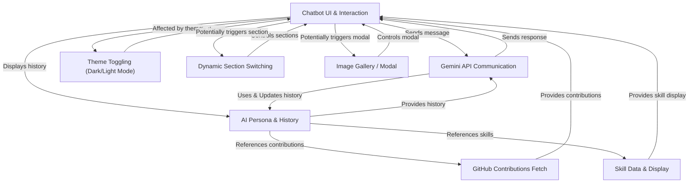

# Brief Discussion of my portfolio and explaining the codes

This is a ** My personal portfolio website which is named as JRN|DEV** designed to showcase the owner's skills, projects, and GitHub activity.
It features an **interactive chatbot**, powered by **Gemini AI** and configured with a specific *persona*, to answer questions about the work.
The site also includes various UI enhancements such as **dark/light theme toggling**, *dynamic switching between content sections*, and an *image gallery modal* for viewing project visuals.

## Visual Overview

## Chapters

1. [Dynamic Section Switching
](01_dynamic_section_switching_.md)
2. [Chatbot UI & Interaction
](02_chatbot_ui___interaction_.md)
3. [AI Persona & History
](03_ai_persona___history_.md)
4. [Gemini API Communication
](04_gemini_api_communication_.md)
5. [GitHub Contributions Fetch
](05_github_contributions_fetch_.md)
6. [Skill Data & Display
](06_skill_data___display_.md)
7. [Theme Toggling (Dark/Light Mode)
](07_theme_toggling__dark_light_mode__.md)
8. [Image Gallery / Modal
](08_image_gallery___modal_.md)

---

Generated by [AI Codebase Knowledge Builder](https://github.com/The-Pocket/Tutorial-Codebase-Knowledge).
